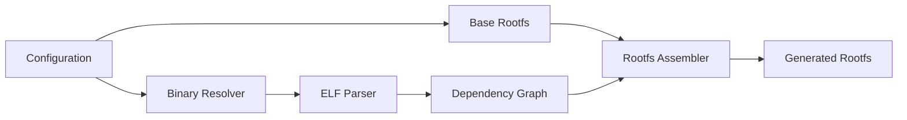
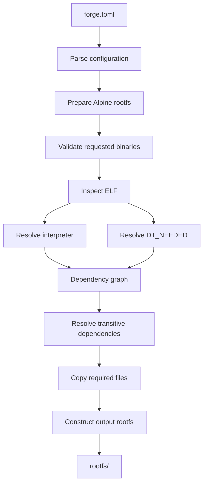
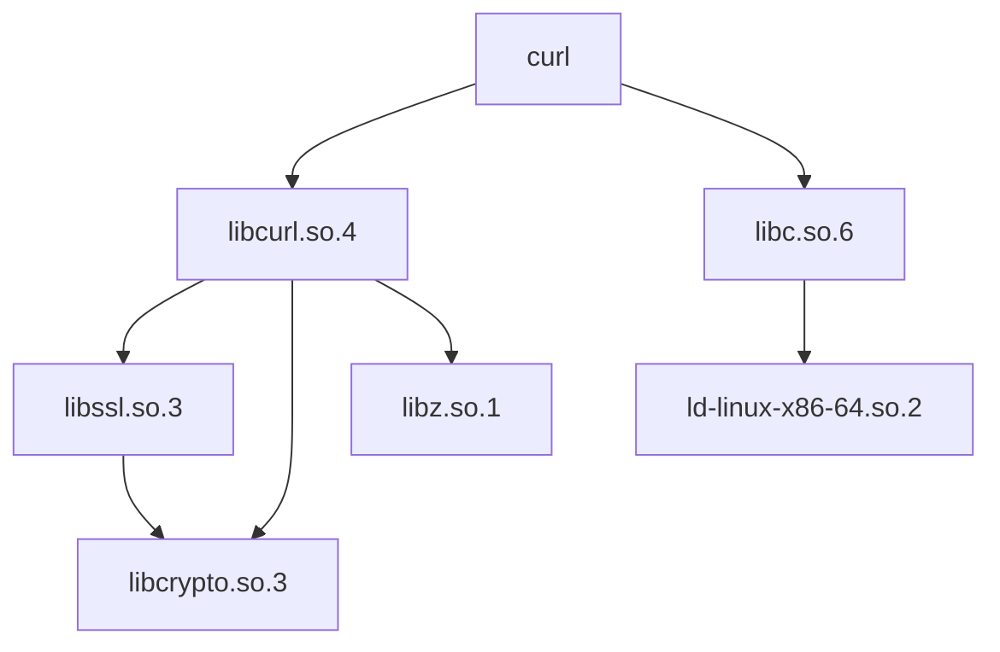
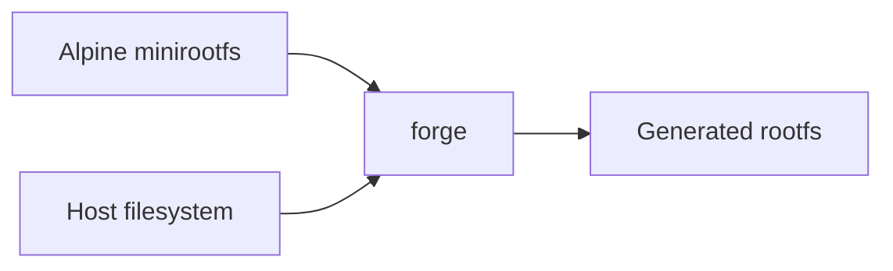
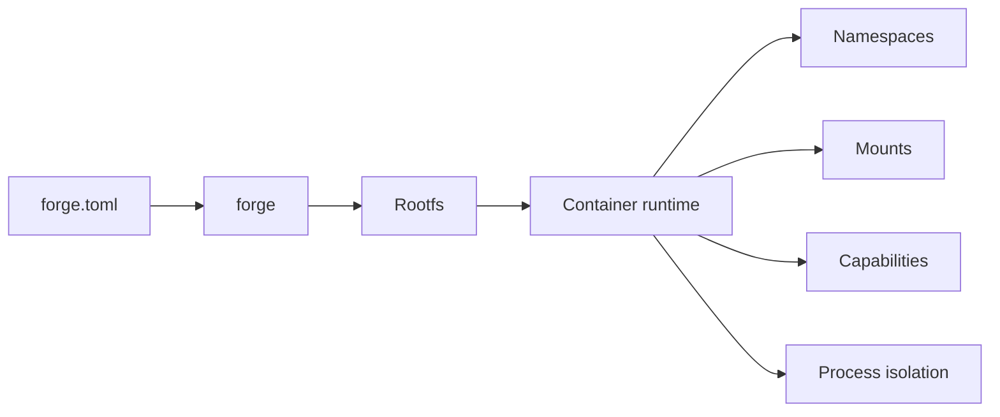

## forge

**Build minimal Linux root filesystems from a base distribution and a declarative list of host binaries.**

`forge` takes a base Alpine Linux root filesystem and a configuration describing the executables you need. It analyses those executables, resolves their runtime dependencies, and assembles everything into a self-contained rootfs.

The goal is simple:

```text
        Alpine
          +
   Selected binaries
          +
 Runtime dependencies
          │
          ▼
     ┌───────────┐
     │   forge   │
     └───────────┘
          │
          ▼
   Minimal rootfs
```

The resulting rootfs can then be consumed by container runtimes such as `cage`, used with namespaces directly, packaged into an image, or inspected and modified like any ordinary filesystem.

## Why forge?

Traditional container images are generally built around package managers and Dockerfile-like build systems.

`forge` takes a different approach.

Instead of saying:

> Install these packages.

you say:

> I need these executables.

For example:

```toml
[base]
distribution = "alpine"
version = "3.22"
architecture = "x86_64"

[binaries]
paths = [
    "/bin/sh",
    "/usr/bin/curl",
    "/usr/bin/git",
]
```

`forge` determines what those programs require at runtime and assembles the necessary files into the rootfs.

This makes it possible to construct small, purpose-built environments without maintaining a package manifest for every dependency.

## Architecture

At a high level, `forge` consists of five stages:



### Components

| Component               | Responsibility                                       |
| ----------------------- | ---------------------------------------------------- |
| **Configuration**       | Defines the base distribution and requested binaries |
| **Base Rootfs**         | Provides the initial Alpine filesystem               |
| **ELF Parser**          | Inspects binaries and extracts runtime metadata      |
| **Dependency Resolver** | Recursively resolves libraries and interpreters      |
| **Rootfs Assembler**    | Copies and reconstructs the required filesystem tree |

## Build pipeline

A build proceeds through a deterministic pipeline.



For example:

```text
/usr/bin/curl
     │
     ├── ELF interpreter
     │
     ├── libcurl.so
     │      ├── libssl.so
     │      ├── libcrypto.so
     │      └── libz.so
     │
     └── libc.so
```

`forge` turns this dependency graph into a filesystem:

```text
rootfs/
├── bin/
│   └── sh
├── lib/
│   ├── ...
│   └── ld-linux-x86-64.so.2
└── usr/
    ├── bin/
    │   ├── curl
    │   └── git
    └── lib/
        ├── libcurl.so.*
        ├── libssl.so.*
        ├── libcrypto.so.*
        └── ...
```

## Dependency resolution

The core of `forge` is its runtime dependency resolver.

For every requested executable, `forge` examines the ELF metadata:

```text
ELF
 ├── Architecture
 ├── ABI
 ├── Program Headers
 │    └── PT_INTERP
 │
 └── Dynamic Section
      ├── DT_NEEDED
      ├── DT_RPATH
      ├── DT_RUNPATH
      └── ...
```

`PT_INTERP` identifies the dynamic linker:

```text
/lib64/ld-linux-x86-64.so.2
```

while `DT_NEEDED` identifies shared-library dependencies:

```text
libc.so.6
libcurl.so.4
libssl.so.3
```

These dependencies are resolved recursively.



A visited set prevents dependencies from being processed more than once.

Conceptually:

```text
resolve(binary):
    if already visited:
        return

    mark visited

    parse ELF

    resolve interpreter

    for dependency in DT_NEEDED:
        resolve(dependency)
```

The dependency graph is therefore traversed once, giving approximately:

```text
O(V + E)
```

where `V` is the number of files and `E` is the number of dependency relationships.

## Host binaries

`forge` is intentionally capable of taking binaries from the host.

Given:

```toml
[binaries]
paths = [
    "/usr/bin/curl"
]
```

the binary is copied into the corresponding location inside the rootfs:

```text
Host                         Rootfs
────────────────────────────────────────

/usr/bin/curl       ───────► /usr/bin/curl
/usr/lib/libfoo.so  ───────► /usr/lib/libfoo.so
/lib/libbar.so      ───────► /lib/libbar.so
```

The original filesystem hierarchy is preserved.

This is important because executables generally expect their dependencies to exist at particular paths.

## Alpine base

The initial implementation uses an Alpine minirootfs as the base.



The Alpine rootfs provides the basic userspace:

```text
/
├── bin/
├── dev/
├── etc/
├── home/
├── lib/
├── proc/
├── root/
├── run/
├── sbin/
├── sys/
├── tmp/
├── usr/
└── var/
```

`forge` then augments this filesystem with the requested host software.

## libc and ABI considerations

Host binaries are not universally compatible with an Alpine base.

Alpine traditionally uses **musl libc**, while many other Linux distributions use **glibc**.

For example:

```text
Ubuntu binary

/usr/bin/foo
      │
      ▼
ld-linux-x86-64.so.2
      │
      ▼
glibc
```

whereas a native Alpine binary may use:

```text
/usr/bin/foo
      │
      ▼
ld-musl-x86_64.so.1
      │
      ▼
musl
```

`forge` therefore treats the ELF interpreter and ABI as first-class information rather than assuming that every Linux executable is interchangeable.

The initial implementation targets a clearly defined host/base combination rather than attempting to transparently solve arbitrary ABI incompatibilities.

## Configuration

A configuration describes **what should exist**, not how it should be copied.

Example:

```toml
[base]
distribution = "alpine"
version = "3.22"
architecture = "x86_64"

[rootfs]
output = "./rootfs"

[binaries]
paths = [
    "/bin/sh",
    "/usr/bin/curl",
    "/usr/bin/git",
    "/usr/bin/python3",
]
```

The configuration deliberately does not contain shared-library dependencies.

Those are derived automatically:

```text
Configuration
     │
     ▼
Requested binaries
     │
     ▼
ELF analysis
     │
     ▼
Dependency graph
     │
     ▼
Required filesystem objects
```

## Output

A successful build produces an ordinary directory containing the root filesystem.

```text
./rootfs/
├── bin/
├── dev/
├── etc/
├── home/
├── lib/
├── proc/
├── root/
├── run/
├── sbin/
├── sys/
├── tmp/
├── usr/
└── var/
```

There is intentionally no proprietary image format.

The output is just a filesystem.

This allows it to be consumed by other tools without requiring `forge` at runtime.

## forge and container runtimes

`forge` does not attempt to be a container runtime.

Its responsibility ends when the root filesystem has been constructed.



For example, `cage` can consume the result:

```text
                    forge
                      │
                      ▼
              ┌──────────────┐
              │    rootfs    │
              └──────────────┘
                      │
                      ▼
                    cage
                      │
          ┌───────────┼───────────┐
          ▼           ▼           ▼
     namespaces   OverlayFS    isolation
                      │
                      ▼
                 container
```

This separation keeps both projects small:

**forge**

> Build the filesystem.

**cage**

> Isolate and execute the process.

## Design principles

### Filesystem, not image

`forge` produces a directory tree rather than introducing another image format.

### Declarative

The configuration describes desired executables. Dependency discovery is automatic.

### Minimal

Only files required by the selected software should be introduced beyond the base filesystem.

### Deterministic

Given the same base and host inputs, the builder should produce the same filesystem contents.

### Explicit

`forge` should fail rather than silently produce an environment where a binary cannot execute.

### Composable

The output should be useful to `cage` and other container tooling without requiring knowledge of `forge`.

## Project structure

The project is intended to remain small and modular:

```text
forge/
├── include/
│   ├── config.h
│   ├── alpine.h
│   ├── elf_parser.h
│   ├── resolver.h
│   ├── rootfs.h
│   └── ...
├── src/
│   ├── main.c
│   ├── config.c
│   ├── alpine.c
│   ├── elf.c
│   ├── resolver.c
│   ├── rootfs.c
│   └── ...
├── tests/
│   ├── config.c
│   ├── alpine.c
│   ├── elf.c
│   └── ...
├── examples/
│   └── minimal.toml
├── Makefile
├── README.md
└── LICENSE
```

## Roadmap

### Foundation

- [x] Define configuration format
- [x] Validate requested host binaries
- [x] Download and extract Alpine minirootfs

### ELF Analysis

- [x] Implement ELF parser
- [x] Validate ELF architecture
- [x] Extract `PT_INTERP`
- [x] Extract `DT_NEEDED`
- [x] Detect static binaries
- [ ] Detect incompatible dynamic linkers
- [x] Add ELF dependency inspection CLI

### Dependency Resolution

- [x] Implement host library resolution
- [x] Implement recursive dependency graph
- [x] Handle library search paths (`RPATH`, `RUNPATH`, system paths)
- [x] Expand `$ORIGIN` in library search paths
- [x] Handle inherited `RPATH`
- [x] Distinguish transitive `RPATH` from non-transitive `RUNPATH`
- [x] Detect missing dependencies
- [x] Detect dependency cycles
- [x] Resolve and validate required dynamic linkers
- [x] Validate dependency ELF architecture

### rootfs Assembly

- [x] Copy requested binaries into the rootfs
- [x] Copy resolved libraries into the rootfs
- [x] Copy required dynamic linker
- [x] Preserve filesystem metadata
- [x] Handle symlinked libraries
- [x] Handle required parent directories

### Special Cases

- [ ] Add support for static binaries
- [ ] Add support for scripts
- [ ] Detect script interpreters
- [ ] Add support for additional architectures

### Reproducibility & UX

- [ ] Add deterministic builds
- [ ] Add build manifest
- [ ] Add caching
- [ ] Improve error reporting

## Philosophy

`forge` should do one thing well:

```text
              "What do I need?"
                     │
                     ▼
              forge.toml
                     │
                     ▼
                  forge
                     │
                     ▼
              "Here it is."
                     │
                     ▼
                rootfs/
```

It doesn't need to manage containers.

It doesn't need to manage processes.

It doesn't need to implement namespaces.

It doesn't need to be a package manager.

It takes a base filesystem, understands executable dependencies, and **forges a runnable rootfs**.
